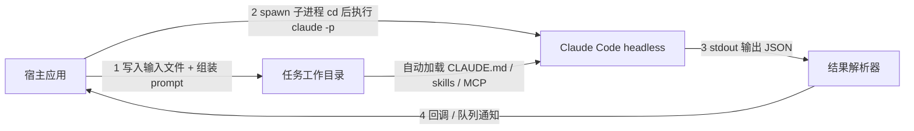

# Claude Code Headless 自动化任务技术实现方案

> 日期：2026-07-30 · 交付对象：执行 agent · 来源：Claude 官方文档核实（headless / settings / MCP / 订阅政策）

## 1. 目标

在宿主应用中程序化调用 Claude Code 的模型能力：给定输入和 prompt，Claude Code 在**预配置的工作目录**下自动使用 CLAUDE.md、skills、MCP 完成任务，异步返回结构化结果。使用已有 Pro/Max 订阅额度，不走 API key 计费。

## 2. 架构总览



流程：宿主应用把输入落盘到任务目录 → 后台子进程执行 `claude -p` → 解析 stdout JSON → 异步回调返回结果。

## 3. 前置条件

| 项 | 要求 |
|---|---|
| Claude Code CLI | 已安装（`claude --version` 验证） |
| 认证 | 本机已登录订阅账号；或服务器场景执行 `claude setup-token` 生成长期 OAuth token，注入环境变量 `CLAUDE_CODE_OAUTH_TOKEN` |
| 计费 | `claude -p` 走订阅额度（官方允许）；**禁止**改用 Agent SDK + 订阅 OAuth（政策不允许，SDK 必须 API key） |
| 使用边界 | 仅供账号本人的自动化；不得包装成多用户产品（违反订阅条款） |

## 4. 任务工作目录规范

每类任务准备一个模板目录，运行时 `cd` 进入后调用。**不要使用 `--bare`**（会跳过 CLAUDE.md、skills、.mcp.json 的自动发现）。

```
task-workspace/
├── CLAUDE.md              # 任务指令与约束（自动加载）
├── .mcp.json              # MCP 服务器定义（自动加载，需预批准）
├── .claude/
│   ├── settings.json      # 权限白名单 + MCP 预批准
│   └── skills/
│       └── <skill-name>/
│           └── SKILL.md   # 自定义 skill（自动发现）
├── input/                 # 宿主应用写入的本次任务输入
└── output/                # 约定 Claude 把交付物写到这里
```

### 4.1 CLAUDE.md 要点

写清楚：任务角色与目标、输入在 `input/`、交付物必须写入 `output/`、输出格式约定（如 JSON schema 或 md 模板）、禁止事项。

### 4.2 .claude/settings.json（关键：非交互预批准）

headless 下无人点确认，所有权限必须预先声明，否则任务卡住或静默跳过操作：

```json
{
  "enabledMcpjsonServers": ["github", "postgres"],
  "permissions": {
    "allow": [
      "Read(**)",
      "Write(output/**)",
      "Edit(output/**)",
      "Bash(python *)",
      "mcp__github__*"
    ]
  }
}
```

- `enabledMcpjsonServers`：预批准 `.mcp.json` 中的服务器，绕过首次交互确认。
- `permissions.allow`：按最小权限原则列白名单；配好后调用命令无需再传 `--allowedTools`。

### 4.3 .mcp.json 示例

```json
{
  "mcpServers": {
    "github": {
      "command": "npx",
      "args": ["-y", "@modelcontextprotocol/server-github"],
      "env": { "GITHUB_TOKEN": "${GITHUB_TOKEN}" }
    }
  }
}
```

## 5. 调用方式

### 5.1 基本命令

```bash
cd /path/to/task-workspace
claude -p "读取 input/ 中的数据，按 CLAUDE.md 要求处理，结果写入 output/" \
  --output-format json \
  --max-turns 50
```

`--output-format json` 的 stdout 返回结构（关键字段）：

```json
{
  "type": "result",
  "subtype": "success",
  "result": "……最终答复文本……",
  "session_id": "xxxx-xxxx",
  "total_cost_usd": 0,
  "num_turns": 12,
  "is_error": false
}
```

### 5.2 宿主应用异步封装（Python 参考实现）

```python
import asyncio, json, uuid, shutil
from pathlib import Path

TEMPLATE = Path("/opt/agent-templates/task-workspace")

async def run_claude_task(prompt: str, input_files: dict[str, bytes],
                          timeout: int = 1800) -> dict:
    # 1. 从模板复制出独立运行目录（并发隔离）
    ws = Path(f"/tmp/claude-jobs/{uuid.uuid4().hex}")
    shutil.copytree(TEMPLATE, ws)
    for name, data in input_files.items():
        (ws / "input" / name).write_bytes(data)

    # 2. 后台子进程执行
    proc = await asyncio.create_subprocess_exec(
        "claude", "-p", prompt, "--output-format", "json",
        cwd=ws,
        stdout=asyncio.subprocess.PIPE,
        stderr=asyncio.subprocess.PIPE,
    )
    try:
        stdout, stderr = await asyncio.wait_for(proc.communicate(), timeout)
    except asyncio.TimeoutError:
        proc.kill()
        return {"ok": False, "error": "timeout"}

    # 3. 解析结果
    if proc.returncode != 0:
        return {"ok": False, "error": stderr.decode()[-2000:]}
    res = json.loads(stdout)
    return {
        "ok": not res.get("is_error", False),
        "result": res.get("result"),
        "session_id": res.get("session_id"),
        "artifacts": [str(p) for p in (ws / "output").rglob("*") if p.is_file()],
        "workspace": str(ws),
    }
```

调用侧 `asyncio.create_task(run_claude_task(...))` 即为异步返回；也可套任意任务队列（Celery、RQ 等），完成后回调宿主。

### 5.3 多轮续接（可选）

```bash
claude -p "继续，补充第二部分" --resume "$SESSION_ID" --output-format json
```

### 5.4 长任务实时进度（可选）

`--output-format stream-json --verbose` 逐行输出事件 JSON，宿主可边跑边转发进度。

## 6. 错误处理与运维

| 情形 | 判断依据 | 处理 |
|---|---|---|
| 任务失败 | `is_error: true` 或 subtype 非 success | 记录 `result` 错误信息，可重试 1 次 |
| 权限不足卡住 | 结果中出现工具被拒/未执行 | 补充 settings.json `permissions.allow` |
| 撞订阅限流 | 报错含 rate limit（5 小时滚动窗口） | 队列退避重试，勿并发过高 |
| 超时 | 进程超 timeout | kill 后标记失败；调大 `--max-turns` 或拆任务 |
| 并发 | — | 每任务独立 copy 工作目录，避免共享目录写冲突 |

## 7. 验收清单

1. `claude --version` 与 `claude -p "回复 ok" --output-format json` 在目标环境跑通（验证安装与认证）。
2. 在模板目录内跑一个用到 MCP 工具的任务，确认无交互批准弹出、工具调用成功。
3. 确认 skill 被触发（结果中体现 skill 行为）。
4. 断网 MCP / 超时 / 权限拒绝三种失败路径均能被宿主捕获并返回错误结构。
5. 并发 3 个任务互不干扰，output/ 各自独立。

## 8. 参考文档

- Headless 模式：https://code.claude.com/docs/en/headless.md
- Settings 参考：https://code.claude.com/docs/en/settings.md
- MCP 配置：https://code.claude.com/docs/en/mcp.md
- CLI 参考：https://code.claude.com/docs/en/cli-reference
- 订阅与 Agent SDK 政策：https://support.claude.com/en/articles/15036540-use-the-claude-agent-sdk-with-your-claude-plan
