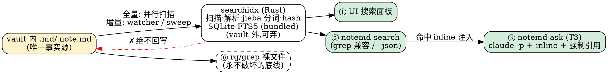

# 检索功能技术规格——单机快速索引 · 零 token 检索 · harness 友好 · agent 分析

> 类型:实施规格(Implementation Spec,**v3.2**)
> 日期:2026-08-10(v1 初稿 → v2 代码级对抗性 review → v3 逐条标注来源/理由 + 合入 TencentDB 借鉴 → v3.1 技术组件经用户对话确认 → **v3.2 双平台 P0:Windows 与 macOS 同批交付,单核心 crate 保算法一致**;修订记录见 §10)
> 评审方式:每条设计决策末尾带 **【源 … · 因 …】** 标注——源=结论出处,因=为什么这么定。质疑任何一条,顺着源可回到证据。

**来源图例**

| 代号 | 指向 |
| --- | --- |
| 研A | `sotvault/2026-06-18-md-as-durable-index-construction-guide.md`(md=真值,build-time 四杠杆) |
| 研B | `sotvault/2026-06-18-independent-memory-mechanism-design-survey.md`(三级 router,分流) |
| 研C | `sotvault/2026-05-20-is-grep-all-you-need-summary.md`(arXiv 2605.15184,harness>retriever) |
| 研D | `sotvault/2026-07-30-claude-memory-design-consensus-spec.md`(C1–C10 确定性结论) |
| 研E | 本仓 `docs/note-recall-layer-design.md`(召回层设计,P3 查询视图) |
| 码 | mdeditor 代码库勘察实测(带 file:line) |
| 库 | sotvault 真实 vault 数据实测(8,826 文件/149MiB) |
| T | TencentDB-Agent-Memory 源码核查(带 file:line) |
| 网 | 2026-08 web 检索:Cursor Instant Grep、Moderne Trigrep、MCP-vs-CLI、AGENTS.md 标准等 |
| 产 | note.md 产品主张(CLAUDE.md 五信念) |
| 判 | 本 spec 自有工程裁决 |
| 确 | **2026-08-10 用户对话确认的组件选型**(三问三答,见 §3.0) |

---

## 0 · 结论速览

新增**平台无关核心 crate `searchidx`**(SQLite FTS5 bundled + jieba-rs 分词,thin adapter 接 Tauri/CLI):全文+字段索引,存本机应用缓存,是 vault 文件的纯函数(可弃、幂等重建)。**macOS 与 Windows 同批交付(P0);每设备索引各自独立、可重算、不同步;算法一致性由"同一 crate + 同一词典 + 路径/换行规范化"保证**。三个消费面:UI 搜索面板、`notemd search` CLI(grep 兼容,任何 agent 零 token 调用)、`notemd ask`(唯一耗 token 的分析层)。harness 策略:不改变 agent 行为,加速它已有的循环。

## 1 · 需求与非目标

| 需求 | 回答 |
| --- | --- |
| 快速全量索引 | 10k 文件/150MB 冷建 < 10s 【源 库 · 因 目标必须锚在真实规模,v1 的 5k/50MB 低估 3 倍】 |
| 快速增量索引 | GUI watcher 保存后 < 500ms 可检索;CLI 调用前新鲜度扫描 【源 判+码 · 因 两进程无 IPC,GUI 关闭时 CLI 不能查到陈旧索引】 |
| 无需多设备同步 | 索引放本机应用缓存,各机各自派生 【源 用户需求+研E§3.5 · 因 索引属机器不属 vault,顺手裁决 recall-layer 未决问题#3】 |
| 检索零 token | T1 热路径纯确定性,零 LLM 【源 研B§3/研D-C5 · 因 "速度问题本质是分流问题",90% 查询不该碰 LLM】 |
| harness 友好 | 五层:L0 裸 grep → L1 CLI → L2 AGENTS.md → L3 MCP(按需) → L4 regex 加速(按需) 【源 研C+网 · 因 harness 影响≥检索器,加速已有循环而非另立门户】 |
| 结果分析走 agent | T3 独立层,inline 注入 + 强制引用 + 冲突弃答 【源 研C结果3/研D-C9 · 因 文件式交付会崩,inline 最稳;冲突不静默】 |

**非目标**:多设备/云端索引;泛化知识图谱【源 研D-C5(06-08 已否决)】;持久 block id【源 研E§3.8】;回写任何 `.md`【源 产-信念2】;首版向量【源 研C+§8 判据 · 因 词法是强基线,T1 覆盖率数据说话】;vault 外 FolderView 根;iOS(§6)。

## 2 · 架构总览



- 索引=可弃影子,md=唯一真值,绝不回写 【源 研A§0(memsearch/memweave/Claude Code 共识)+产-信念2 · 因 file-over-app 是最高约束】
- 用 Rust 新模块而非扩展前端 `BacklinkIndex` 【源 码(backlinks.ts:纯内存/JS 全扫/只索引 .note.md/1MB 上限) · 因 现有管道撑不住全文,且 CLI 需要 headless】
- **模块独立性(v3.2)**:`searchidx` 做成不依赖 tauri 类型的核心库(扫描/解析/分词/schema/查询全在内),Tauri command、CLI、watcher 只是三个 thin adapter;平台差异(路径、监听后端、缓存目录)被压进 adapter 层 【源 用户需求("搜索部分保持相对独立,算法尽量保持一致")+判 · 因 同一份核心代码在两平台编译 = 算法一致性的最强保证,且核心库可脱离 GUI 单测】
- **跨平台确定性规约(v3.2)**:①索引内 `path` 一律存 vault 相对路径且分隔符规范化为 `/`(含 `source_ref` 输出——agent 在两平台看到同一格式);②文本处理前按行剥 `\r`(CRLF 规范化),行号按 `\n` 计;③jieba 词典/版本随二进制内嵌,两平台字节相同;④`content_hash` 对原始字节计算,不受平台影响 【源 判 · 因 "算法尽量一致"要落成可测不变式:同一批 fixtures 在两平台的查询结果必须一致(§7 新增验收)】
- 反链层不动,远期改读本索引 links 表 【源 判 · 因 职责分离,避免一次重构两个系统】

## 3 · 索引引擎规格

### 3.0 组件成熟度清单(v3.1 已确认)

| 组件 | 选型 | 成熟度依据 | 状态 |
| --- | --- | --- | --- |
| 存储/全文引擎 | SQLite FTS5,**全平台 bundled** | 地表最广泛部署的存储引擎;FTS5 2015 年至今生产验证;bundled=版本钉死、编译选项自控、全平台行为一致 | **确**(弃系统库方案:Apple 编译选项无契约、版本随 OS 漂移) |
| SQLite 绑定 | `rusqlite` (bundled feature) | Rust 生态事实标准绑定 | 确(随上条) |
| 中文分词 | **`jieba-rs`,索引与查询双侧 `cut_for_search`** | 中文分词生态最成熟实现;cut_for_search 模式(长词+子词重叠输出)即为搜索索引场景设计 | **确**(弃自研 bigram;连带工程约束见 §3.2) |
| 散文分块 | `pulldown-cmark`(OffsetIter 取精确偏移) | Rust markdown 解析事实标准(mdBook/rustdoc 在用),边界情况(嵌套围栏/HTML 块/setext)已被海量文档验证 | **确** |
| frontmatter | 自研宽容解析(只读浅层键) | OKF §11 要求消费者宽容;严格 YAML 库对坏 frontmatter 抛错反而违约 | **确**(弃 saphyr 全量 YAML) |
| 目录遍历 | `walkdir` + `ignore` | ripgrep 作者出品、ripgrep 本体在用 | 无争议 |
| 文件监听 | `notify 7` | 已在依赖树(vault_sync 在用) | 无争议 |
| hash | `sha2` | 已在依赖树 | 无争议 |
| CLI | `clap 4` | 已在依赖树 | 无争议 |
| T3 进程管理 | 复用 claude-agent 插件 discover/engine | 本仓已落地 | 无争议 |
| 词典压缩 | `flate2`(gzip) | zip crate 的既有传递依赖,复用 | 随 jieba 引入 |

### 3.1 体积决策(随组件确认更新)

- 全平台 bundled SQLite:约 +0.9MB;jieba 词典 gzip 内嵌约 +2.5MB(裸词典 ~5MB,构建期压缩、启动时解压);pulldown-cmark 约 +0.2MB 【源 确+判 · 因 可靠性优先于体积是本次确认的取向】
- **体积硬门更新:macOS release 二进制总增量 < 4MB,实测数字写入 PR**;README 的 "7MB 下载/11MB 安装" 表述需产品层同步更新(预计安装 ~14-15MB)——这是本次确认的显式代价,不得静默 【源 码(README 承诺;曾以体积否决 MinGit)+确 · 因 承诺变更必须外显,不能靠 PR 附注消化】

### 3.2 分词器(`tokenize.rs`,索引与查询共用同一实例)

- **jieba-rs `cut_for_search` 双侧一致**:索引与查询同一分词模式,长词与内部子词重叠输出保召回 【源 确+判 · 因 普通 cut 会造成"查'增量'漏'增量索引'"的词边界漏检,cut_for_search 是该问题的标准解】
- **确定性约束(幂等的新前提)**:jieba-rs 版本与词典锁死;`meta` 记录 `tokenizer_id = jieba-rs@<ver>+<dict_sha256>`;不匹配即自动全量重建 【源 判+研A§3 · 因 分词随版本漂移=索引漂移,必须把"纯函数"的定义域扩到分词器版本】
- **惰性加载**:仅当输入含 CJK 时才解压+构建 jieba 实例(一次 ~200-400ms);纯 ASCII 查询零开销;GUI 常驻进程只付一次 【源 判 · 因 CLI 有启动预算,不能每次无差别付词典解析税】
- ASCII 字母数字段直接词元化(小写),不过 jieba 【源 判 · 因 代码/英文查询无需分词器】
- **召回兜底**:`"引号短语"` 命中后用 `blocks.text` 做精确子串复核;CJK 查询 FTS 零命中或单字/未登录词 → 降级 `blocks.text LIKE` 有界扫描(带 LIMIT+超时,标注 `route:"t1-scan"`) 【源 判 · 因 词典分词的盲区(新词/人名/单字)不能变成漏检;T 项目"拒绝全表扫描兜底"的教训在此例外,理由是语料有界+扫描受限】
- 预分词文本存 FTS 列,FTS5 tokenizer 用默认 unicode61(只按空格切,预分词是唯一权威) 【源 判 · 因 避免自定义 FTS5 tokenizer 的 C API 复杂度】

### 3.3 Schema(`store.rs`)

```sql
CREATE TABLE files(
  id INTEGER PRIMARY KEY, path TEXT UNIQUE NOT NULL,
  ext TEXT NOT NULL, mtime INTEGER, size INTEGER, content_hash TEXT,
  title TEXT, concept_type TEXT, tags_json TEXT,
  doc_date TEXT, date_inferred INTEGER,
  human_verified INTEGER DEFAULT 0);
CREATE TABLE blocks(
  id INTEGER PRIMARY KEY, file_id INTEGER NOT NULL REFERENCES files(id),
  line_start INTEGER, line_end INTEGER,
  breadcrumb TEXT, text TEXT, level TEXT,          -- level: file|section|line
  is_annotation INTEGER DEFAULT 0, agent_by TEXT);
CREATE INDEX blocks_file ON blocks(file_id);
CREATE VIRTUAL TABLE blocks_fts USING fts5(tok_text, tok_breadcrumb);  -- 标准表,rowid=blocks.id
CREATE TABLE links(file_id INTEGER, kind TEXT, target TEXT, line INTEGER);
CREATE TABLE meta(key TEXT PRIMARY KEY, value TEXT);  -- schema_version/vault_root/built_at/tokenizer_id
```

- 块三分辨率(file/section/line) 【源 研A杠杆2(RAPTOR:md 层级天然是多分辨率树) · 因 "找一条原话"命中 line,"这文档讲什么"命中 file,粒度匹配=又快又准】
- breadcrumb 在索引时派生,不写回文件 【源 研A杠杆1(contextual self-containment 降检索失败 35–49%)+产-信念2 · 因 吃到自包含红利且零文件污染】
- 标准 FTS 表而非 external-content;snippet 从 `blocks.text` 自产 【源 判(v2 修订#8) · 因 external content 的 snippet 会吐分词乱码】
- schema_version/tokenizer_id 不符或损坏 → 删库重建,无修复逻辑 【源 研A§3(rebuild=纯函数) · 因 可弃派生的直接红利,自愈最简】

### 3.4 存储位置

GUI `app_local_data_dir()/search/<sha256(vaultRoot)前16>/index.db`;CLI 侧解析同一路径,固定测试锁定 【源 码(mdblock/path.ts 先例) · 因 vault 外=git 零噪音+天然可弃;两进程必须同库】。WAL + `busy_timeout=5000` 【源 判 · 因 双进程并发写的最低配】。

**Windows 路径陷阱(v3.2)**:CLI 必须用 `dirs::data_local_dir()`(→ `%LOCALAPPDATA%`,与 Tauri `app_local_data_dir` 一致),**不能用 `dirs::data_dir()`**——后者在 Windows 是 Roaming AppData,与 GUI 不同库,且 Roaming 会随域账户漫游,违背"每设备索引独立"的本义(macOS 上两者恰好同路径,掩盖了这个坑) 【源 判+用户需求(每设备独立) · 因 索引属于机器,语义上就该在 Local;两平台同库契约以双平台测试锁定】

### 3.5 字段派生

- `doc_date` 降级链:文件名日期前缀 → frontmatter `created|date|generated.at` → mtime(标 inferred) 【源 研E§3.3 时间模型+库(文件名日期是 vault 主流约定) · 因 支撑 after:/before: 与"近 30 天关于 X"】
- frontmatter 自研宽容解析(只读 `type/title/description/tags/created/date/generated/verified` 浅层键),解析失败字段置 NULL,正文照常索引 【源 确+OKF §11 消费者宽容义务 · 因 索引是消费者,不得以合规拒文件;宽容手写解析恰好比严格 YAML 库更符合义务】
- 人写信号:`by::` 不匹配 `/^human:/` → `agent_by`;`type:: annotation|question` → `is_annotation`;frontmatter `verified` 含 `human:` → `human_verified` 【源 库(v2 修订#3:✦/● 是渲染物不可靠;`by::` 108 处全 agent;annotation 56 文件;verified 仅 7 文件且值为 `human:me`) · 因 用机器可判的属性行,匹配前缀不写死 id;verified 信号有效但稀疏,只做小幅加成】

### 3.6 分块规则

- `.note.md`:块=大纲节点(行+属性行),breadcrumb=祖先链(每级截 40 字,`>` 连接);属性行不进 `tok_text`;Rust 缩进解析以 TS `parseOutline` fixtures 交叉验证行归属 【源 研E§3.1+码(markdown.ts:82) · 因 与召回层同一数据模型;防两套解析器漂移】
- 散文 `.md`:**用 `pulldown-cmark` 的 OffsetIter 分块**——段落/标题/代码围栏为块,字节偏移映射回行号,breadcrumb=标题链;另建 file 级与 section 级块 【源 确+研A杠杆2 · 因 markdown 边界情况交给事实标准库,自研只留大纲缩进这一小块】

### 3.7 全量构建(`scan.rs`)

- `walkdir`+`ignore` 并行;跳 `.` 目录/symlink/非 md;护栏 = `largeFileThresholdMb`(默认 10MB) 【源 库(v2 修订#2:1MB 护栏会砍掉 46% 语料)+码(与 git 门禁同值) · 因 全文索引不能沿用反链的护栏逻辑】
- vault 设置新增 `searchExcludeDirs: string[]`(默认空) 【源 判+库 · 因 排除权给用户,不替用户拍板】
- 全库单事务批量写;打开 vault 时缺库/损坏→全建,否则 sweep 补缺口 【源 判 · 因 构建速度与自愈的最简组合】

### 3.8 增量与双进程一致性

- GUI:`watch.rs` 自持 notify 递归 watcher,300ms debounce,`(mtime,size)` 快路径,hash 变则文件粒度替换;洪峰(>500 文件)降级为全量 sweep 【源 码(backlinks-io 300ms;vault_sync/watcher.rs 模式)+研E§3.5 · 因 文件粒度增量毫秒级,块级 diff 不值得】
- P0 不与 vault_sync watcher 合并,合并列 P3 技债 【源 码(强耦合其 run_loop) · 因 隔离风险,拍板不留"或"】
- CLI:默认先新鲜度 sweep(walk+stat 比对,仅重索引差异),8.8k 文件无变更 < 300ms;`--no-sweep` 跳过 【源 判(v2 修订#5) · 因 GUI 关闭时 CLI 必须自证新鲜】
- sweep 硬超时 2s:超时即用现有索引作答 + stderr 警告,不阻塞不报错 【源 T auto-recall.ts:72-99 · 因 检索绝不阻塞调用方,降级优于失败】
- 并发收敛不变式:索引写入=文件内容(+分词器版本)的纯函数+文件粒度幂等替换 → GUI/CLI 并发写任意交错必收敛,免 IPC/锁协商 【源 判(v2 修订#5)+码(两进程无通话渠道) · 因 用数学性质替代协调机制】

## 4 · 检索路由与排序

- 三级路由:T1 确定性(默认,零 LLM,目标吃掉 ~90%)→ T2 语义(预留)→ T3 agent 分析(用户显式发起) 【源 研B§3/§10+研D-C5 · 因 分流是速度的本质;T3 无隐式升级,行为可预测(研D-C9 Index Predictability 的单机最简实现)】
- 查询语法:裸词项(AND)、`"短语"`、`tag: type: path: page:[[X]] after: before: ext:`,UI 与 CLI 同一解析器 【源 判 · 因 过滤器映射 agent 与人表达意图的方式】
- 排序:`ORDER BY bm25(blocks_fts,1.0,2.0)`(**FTS5 bm25() 越小越相关,升序**);归一化 `1/(1+rank)` 【源 T sqlite.ts:290-297 · 因 现成的踩坑答案,负值语义显式化】
- 业务加成(常量初值,调参须过 §7 Retrievability 回归):精确短语 ×1.3;file/section 命中 ×1.2;`is_annotation` ×1.2;`human_verified` ×1.1;`agent_by` 非空 ×0.85;时间衰减 ×(1+0.2·e^(−age_days/180)) 【源 产-信念1+研D-C8 · 因 你留过判断的内容优先被召回;AI 生成物降权是反"记忆自我繁殖"的第一道防线(§5-T3)】
- 将来若加 `--min-score`,必须带小语料兜底:全部低于阈值但总数 ≤ limit 时信任 MATCH 排序返回 【源 T auto-recall.ts:426-435 · 因 语料极小时 IDF→0,BM25 绝对分不可信】
- T2 留位:blocks 加 embedding 列,本地 ONNX,零 token;与 BM25 融合用 **RRF(k=60,`1/(60+rank)`,同 id 相加)** 【源 T search-utils.ts:18-62+研B共识2 · 因 BM25 与 cosine 量纲不可比,RRF 是 IR 标准做法;反面教训:T 有三份重复实现,我们单一实现】

## 5 · Harness 友好接入(五层)+ T3 契约

核心原则:**加速 agent 已有的循环,不要求它改变行为** 【源 研C+网(MCP-vs-CLI:紧循环 CLI 快于 MCP) · 因 Claude Code/Codex 从训练数据内化了 Unix 约定,最友好的接口长得像 grep】。

**L0 · 裸文件底线**:rg/grep 永远可用;本功能任何部分失效不得影响 L0 【源 产-信念2 · 因 file-over-app 的检索面】

**L1 · CLI 契约**(builtin,纯 Rust headless 【源 码(builtin.rs 无 webview;cli_startup_timing.rs 500ms 预算) · 因 紧循环需要快启动】):

```
notemd search <query...> [--vault PATH] [--limit N=20] [--json] [--context N]
                         [--no-sweep] [--rebuild] [--stats]
                         [--tag --type --path --after --before --ext]
```

- 缺省输出 `path:line:text` 按相关度排序;退出码 0=有命中/1=无/2=错误 【源 网+研C · 因 grep 形状=零学习成本,agent 靠退出码分支】
- `--json` 含 `route/took_ms/score/breadcrumb/doc_date/source_ref("path#L120")/provenance(agent_by/human_verified)` 【源 研D-C8+T · 因 回源锚内建;provenance 外显让 agent 能优先原始来源】
- 索引不可用→自动降级直接扫描,stderr 单行提示,绝不报错退出 【源 T store/types.ts:7-15+判 · 因 agent 被错误搞糊涂的代价大于慢一次】
- vault root:headless 新写 ~5 行走 `shared_config::config_path()`;`--vault` 为一等旗标 【源 码(v2 修订#4;Windows CLI 配置目录有已知 bug) · 因 不能复用现有函数,显式旗标兜底 Windows】

**L2 · AGENTS.md 约定**:模板加 "## Searching this vault" 节,§196 清扫协议示例升级为 `notemd search`;存量 vault 由 GUI 检测后**一键追加、人确认**,绝不静默改写 【源 网(AGENTS.md 6万+ 仓库标准)+码(v2 修订#7)+产-信念3 · 因 harness 选工具靠它读到的文档,这是杠杆最高的一步;传播必须过人】

**L3 · MCP 包装(P3)**:`notemd mcp-serve`,判据=出现无 shell 消费者 【源 网 · 因 有 shell 时 CLI 更快零配置,MCP 只做兜底】

**L4 · regex 索引加速(P3)**:trigram 层加速裸 grep 路径,判据=rg 实扫 > 1s 【源 网(Cursor/Trigrep/xgrep) · 因 让不走 CLI 的 agent 也吃到索引红利;当前 149MB rg 仍百 ms 级,不做】

**T3 · `notemd ask` 契约**(唯一耗 token 的层;复用 claude-agent 插件 discover/engine 【源 码 · 因 不重造 claude 进程管理】):

1. 命中 **inline** 拼进 prompt,不落中间文件 【源 研C结果3(文件式交付使 Codex 从 93.1 崩到 55.2) · 因 不给 agent 制造脆弱的多步文件闭环】
2. 注入预算:单条 ≤600 字符/总 ≤20,000 字符;超预算按**码点边界**截断(`char_indices()`),截断处追加 "…(已截断;可用 notemd search --context 查看全文)" 【源 T auto-recall.ts:708-789+:27-29 · 因 预算防上下文爆炸;码点截断防 U+FFFD;后缀把"深挖"主动权交还 agent】
3. 注入前转义命中文本中的闭合标签(`</...>` → `&lt;/...&gt;`) 【源 T sanitize.ts:288-294+库(agent-sessions/ 全是含标签/注入类文本) · 因 防 vault 内容越界闭合、劫持分析 prompt——对本 vault 是真实风险】
4. 反自我繁殖三道防线:AI 产物落盘必带 OKF `generated.by`+`sources`(okf.rs 已有)→ 索引侧 `agent_by` 降权 ×0.85(§4)→ prompt 规约"引用优先原始来源,AI 生成文档只作线索" 【源 T index.ts:542-651+研D-C8 · 因 ask 产物被再索引→再召回→AI 综述复利覆盖原始证据,必须层层衰减】
5. prompt 分区:稳定内容(vault 约定/引用规约/工具指南)放 system 尾部,每次命中列表放 user 前缀 【源 T auto-recall.ts:186-218 · 因 命中 provider prompt cache,反复 ask 时纯省钱】
6. 迭代限额写进 prompt:search 迭代 ≤5 次,无果即报告证据不足;证据冲突时并列双方、不裁决 【源 T MEMORY_TOOLS_GUIDE(≤3 次)+研D-C9(abstain) · 因 防搜索死循环;冲突不静默】
7. 每个论断强制 `file#line` 引用,evaluator 校验覆盖率 【源 研D-C8+研C · 因 幻觉唯一入口被隔离在 T3,引用+回源让人眼可校验】
8. 注入预算的 token 估算用零依赖启发式:CJK×1.5 + 其余÷4 【源 T after-tool-call.ts:377-386 · 因 不引入 tokenizer 依赖;需更准时移植 T 的 fast-token-estimate.ts(自称 2-7% 误差)】

## 6 · 平台范围(v3.2:双平台 P0)

**macOS 与 Windows 同批交付,同一 `searchidx` 核心 crate,索引/UI/CLI/watcher 四件套两平台全有;每设备索引独立可重算,无跨设备同步** 【源 用户需求 · 因 v3.1 的"macOS 先行"已按要求升级】。iOS 维持 `#[cfg(not(target_os="ios"))]` 整模块排除 【源 码(vault_sync 先例)】。

Windows 侧从"等 pc-port"转为**本功能自带的三项 P0 工作**(原对抗性 review 已录问题,现进入本 spec 范围):

1. **CLI 配置目录修复**:`cli::resolve_config_dir()` 现在 Windows 上手拼 mac 风格路径(Git Bash 得 `%HOME%\Library\...`,cmd 退化为 `.`),与 GUI 的 `%APPDATA%\net.notemd.app` 读到不同 settings 【源 码 windows-port-analysis:173-186 · 因 headless vault-root 解析依赖它,不修则 Windows CLI 根本找不到 vault】。修法:统一走 `dirs::config_dir().join(BUNDLE_ID)`(两平台都正确)。
2. **CLI 入口**:Windows 无 symlink 分发,`is_cli_mode` 的 argv[0] 判定不可达 【源 码 windows-port-analysis:188 · 因 已知缺陷】。修法:安装器写 `notemd.cmd` shim(`@"%~dp0mdeditor.exe" --cli %*`)进 PATH——零体积、`--cli` 显式入口本就可用;AGENTS.md 的 Windows 示例注明。
3. **watcher 后端**:notify 7 在 Windows 走 ReadDirectoryChangesW,无需 `macos_fsevent` 之外的 feature 变更,但洪峰/降级行为须在两平台分别过测试 【源 码 Cargo.toml+判 · 因 两平台事件语义有差异(改名/删除的事件序不同),降级路径是兜底】。

## 7 · 指标与验收(规模锚定 库 实测:8,826 文件/149MiB;v3.1 随组件确认更新)

| 指标 | 门槛 | 源 · 因 |
| --- | --- | --- |
| 全量冷建 10k/150MB | < 10s(含 jieba 分词) | 库 · 3 倍实测规模重定 |
| 无变更 sweep | < 300ms | 判 · CLI 默认路径可用性下限 |
| GUI 保存→可检索 | < 500ms | 研A§4 · 新鲜度是"快"的另一半 |
| 查询 p50/p95(索引热) | < 10ms/30ms | 研B§3 · T1 的本分 |
| CLI 端到端:ASCII 查询 | < 800ms | 码 cli_startup_timing · 纳入同款测试 |
| CLI 端到端:CJK 查询(含 jieba 惰性加载) | < 1.2s | 确+判 · jieba 词典解析税只在 CJK 查询付,预算相应放宽 |
| macOS 二进制总增量 | **< 4MB 硬门**(sqlite ~0.9 + jieba gzip ~2.5 + cmark ~0.2) | 确 · 可靠性优先的显式代价;README 体积表述需产品层同步更新 |
| 索引库大小 | < 2× 语料(词法分词比 bigram 省) | 判 · 实测写入 PR |
| % resolved at T1 | ≥ 90% | 研B§11/研D-C5 · 分流健康度 |
| Retrievability 回归集(100 条已知事实,含新词/人名/单字用例) | 100%,CI 常跑 | 研A§4 · 排序与分词盲区的守门员 |
| 删库重建一致性 | 逐字节一致(同 tokenizer_id 下) | 研A§3 · 索引=纯函数的验收形式 |
| GUI+CLI 并发收敛 | 专项测试 | 判 §3.8 · 免协调前提必须测试锁死 |
| **跨平台一致性**:同一 fixtures 两平台索引后,同一查询的命中集与排序一致(路径统一 `/` 后逐字段比对) | CI 双平台矩阵(macOS+Windows)常跑 | 用户需求+判 §2 规约 · "算法尽量一致"的可验收形式 |
| Windows CLI:cmd 与 Git Bash 下 `notemd search` 均可用且与 GUI 同库 | 契约测试 | 码 windows-port-analysis · §6 两项修复的验收 |
| T3 引用覆盖率 | 100%,evaluator 校验 | 研D-C8/研C · 证据链是 T3 存在前提 |

## 8 · 实施计划(每项含完成判据,可按序交给 agent 执行)

**P0 索引内核+CLI(macOS+Windows 双平台)**:① 核心 crate `searchidx`(store/tokenize/parse/scan/query;jieba cut_for_search 双侧、tokenizer_id 落 meta、pulldown-cmark 分块、路径 `/` 与 CRLF 规范化)——判据:幂等/Retrievability/性能门全绿,tokenize fixtures(中英混排/围栏/单字/未登录词/CRLF)全过,**跨平台一致性测试双平台过**;② `cli.rs`+router/builtin 加 `search`(headless vault-root 新写、jieba 惰性加载)+ **Windows 两修复:`resolve_config_dir` 统一 `dirs::config_dir()`、安装器 `notemd.cmd` shim**——判据:输出格式/退出码/降级/`--vault` 契约测试+双档启动预算测试,cmd/Git Bash 双环境过;③ `watch.rs`+GUI 集成——判据:500ms 新鲜度/洪峰降级/并发收敛测试双平台过;④ vault 设置 `searchExcludeDirs`。
**P1 UI+约定层**(依赖 P0①):⑤ Tauri commands+side-panel 搜索面板+行级跳转+Cmd⇧F——判据:GUI 实机验证;⑥ AGENTS.md 模板节+存量一键追加(人确认)+`--help` 完整化——判据:追加不触碰已有内容的 diff 测试。
**P2 agent 分析**(依赖 P0+claude-agent 插件):⑦ `notemd ask` 按 §5-T3 八条契约实现——判据:引用覆盖率/预算截断/转义/冲突弃答用例。
**P3 判据触发,不排期**:向量 T2(%T1 持续<90% 且失败查询呈语义改写特征);MCP(出现无 shell 消费者);trigram regex 加速(rg>1s);watcher 合并 vault_sync 广播(技债);反链改读 links 表。

## 9 · 降级矩阵(格式借自 T 文档 §6;数据永不丢失是硬约束)

| 故障 | 降级行为 | 数据丢失 |
| --- | --- | --- |
| 索引库损坏/schema 或 tokenizer_id 不符 | 删库全量重建 | 否(索引可弃) |
| jieba 词典解压/初始化失败 | 该查询降级 LIKE 有界扫描+警告;索引侧报错不写入 | 否 |
| CLI sweep 超时(>2s) | 用现有索引作答+stderr 警告 | 否(可能陈旧) |
| watcher 事件洪峰(>500 文件) | 降级为一次全量 sweep | 否 |
| watcher 崩溃/句柄失效 | 下次打开 vault 或 CLI sweep 补齐 | 否 |
| 单字/未登录词查询(分词盲区) | LIKE 有界扫描,`route:"t1-scan"` | 否 |
| CJK 查询 FTS 零命中 | 自动 LIKE 兜底一次,仍零命中才返回退出码 1 | 否 |
| frontmatter 解析失败 | 字段置 NULL,正文照常索引 | 否 |
| 单文件超护栏(>10MB) | 跳过该文件,`--stats` 可见跳过清单 | 否(rg 仍可查) |
| GUI+CLI 并发写 | WAL 互斥+幂等替换,自然收敛 | 否 |
| T3 claude 不可用/超时 | 返回 T1 原始命中+说明,不出分析 | 否 |
| T3 检索证据冲突 | 并列矛盾,弃答不裁决 | 否 |

## 10 · 修订记录

**v1→v2(代码级对抗性 review,十条)**:①规模低估 3 倍(库实测 8,826/149MiB);②1MB 护栏砍掉 46% 语料→10MB;③✦/●/human:bruce 信号不可靠→`by::`/annotation/前缀匹配;④resolve_vault_root 需 AppHandle→CLI 新写+`--vault`;⑤CLI 陈旧索引盲区→sweep+收敛不变式;⑥体积从附注升为硬门;⑦AGENTS.md 模板不传播→存量一键追加;⑧external-content snippet 乱码→标准表自产 snippet;⑨watcher 拍板独立实例;⑩builtin headless 路径验证成立。

**v2→v3(TencentDB-Agent-Memory 源码核查后采纳,均标注在正文)**:采纳——注入预算+码点截断+深挖后缀、闭合标签转义、反自我繁殖三防线、prompt cache 分区、迭代限额、token 启发式、超时 resolve-not-reject、bm25 归一化+小语料兜底、RRF k=60 留位、接口永不 throw、降级矩阵格式。不采纳——L0-L3 记忆金字塔/场景/人格(agent-memory 有损压缩,与 vault human-side 定位相反,研D-A1);Mermaid 状态机与上下文压缩(harness 侧职责);warm-up/定时器族(零 LLM 无此问题);JSONL 双写(md 即真相源);多端乐观锁(非目标)。

**v3→v3.1(2026-08-10 用户对话确认组件选型)**:①SQLite 改**全平台 bundled**(弃"macOS 系统库"方案;可靠性>体积,版本钉死保幂等);②中文分词改 **jieba-rs**(弃自研 bigram;取生态最成熟组件),连带落地:cut_for_search 双侧一致、tokenizer_id 入 meta 版本锁、词典 gzip 内嵌、CJK 惰性加载、LIKE 兜底链;③散文分块用 **pulldown-cmark**、frontmatter 维持自研宽容解析。连带调整:体积硬门 300KB→**4MB**(README 表述需产品层更新)、CLI 预算分双档(ASCII 800ms/CJK 1.2s)、索引大小预估 2.5×→2×、Retrievability 回归集增加分词盲区用例、降级矩阵增加 jieba 两行。

**v3.1→v3.2(2026-08-10 用户要求:双平台、每设备索引独立、算法一致)**:①平台范围从"macOS 先行"改为 **macOS+Windows 同批 P0**(§6);②`searchidx` 升格为平台无关核心 crate,Tauri/CLI/watcher 皆 thin adapter(§2);③新增跨平台确定性规约:路径统一 `/`、CRLF 规范化、词典内嵌字节一致、hash 对原始字节(§2),并入 §7 验收(CI 双平台矩阵);④Windows 两项既有缺陷(CLI config-dir、CLI 入口)从"等 pc-port"收编为本功能 P0 工作,修法定案:`dirs::config_dir()` 统一 + `notemd.cmd` shim(§6);⑤发现并修复存储位置的 Windows 陷阱:CLI 必须 `data_local_dir()`(Local)而非 `data_dir()`(Roaming),Roaming 漫游违背"每设备独立"(§3.4)。

## 11 · 残余风险

- **README 体积承诺与 +4MB 的冲突是产品决策不是工程决策** → 已在 §3.1/§7 外显,发布前须改 README 表述或回退组件选型 【源 确】
- Windows 双平台 P0 使工作量与测试矩阵近乎翻倍(§6 三项+CI 双平台) → 若排期紧,可裁剪的是 Windows 的 UI 面板与 watcher(索引+CLI 保住 agent 场景),核心 crate 不裁 【源 判 · 因 给排期留一个不牺牲算法一致性的降级选项】
- jieba-rs 版本升级导致分词漂移 → tokenizer_id 版本锁+自动重建已覆盖,代价是升级后一次全量重建(~10s) 【源 判】
- 索引磁盘占用超 2× 预估 → 先 `searchExcludeDirs` 排除会话语料,再评估 FTS detail 降级 【源 判】
- Rust 分块与 TS parseOutline 漂移 → fixtures 交叉验证;分块只影响 breadcrumb 粒度,不影响可检性 【源 判】
- `human_verified` 信号过稀(7 文件) → 保留但不宣传,数据补齐后自然生效 【源 库】
- T3 幻觉 → 引用强制+回源+降权三重约束,残余靠人眼校验 【源 研D-C8】

## 参考

sotvault 研究:见文首图例 研A–研D。TencentDB-Agent-Memory:`/sessions/…/TencentDB-Agent-Memory`(关键位点已内联标注)。Web(2026-08):[MCP vs CLI](https://manveerc.substack.com/p/mcp-vs-cli-ai-agents) · [Cursor Fast regex search](https://cursor.com/blog/fast-regex-search) · [Moderne Trigrep](https://moderne.ai/blog/from-grep-to-moderne-trigrep-code-search-for-agents) · [xgrep](https://github.com/momokun7/xgrep) · [Writing CLI tools AI agents want to use](https://dev.to/uenyioha/writing-cli-tools-that-ai-agents-actually-want-to-use-39no) · [Grep replacement is three tools](https://zzet.org/gortex/grep-replacement-for-ai-agents/)
