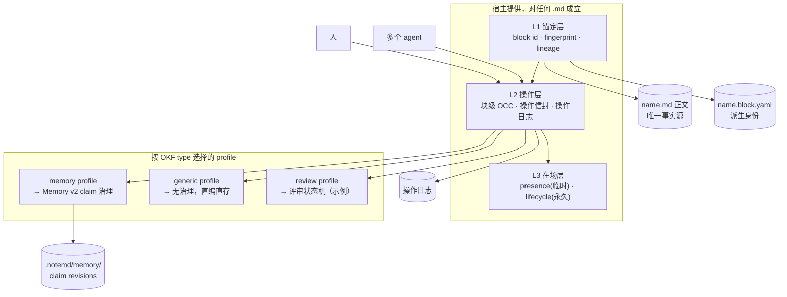

# 共写面（Co-authored Surface）设计

> 日期：2026-09-04 · 状态：设计提案，待用户裁决可行性
> 上游构想：《MEMORY 应成为人和 Agent 共同维护的背景知识文档》
> 基准代码：`src/lib/blockchunk/`、`src/lib/blockio/`、`src/editor-kit/`、
> `src-tauri/src/memory_control/v2/`、`src-tauri/src/plugin_runtime/host_api.rs`
> 规范基准：`docs/okf-v0.2-format-constraints.md`、`docs/2026-09-01-memory-protocol-v2-rfc.md`
>
> 一句话：**MEMORY 编辑器不是一个产品，是"共写面"这一通用能力的第一个 profile。
> 把它拆成四层——锚定 / 操作 / 在场 / 治理——前三层归宿主、对任何 `.md` 都成立，
> 只有第四层按 OKF `type` 换 profile。**

---

## 0. 本文与上游构想的关系

采纳：scope 化、叙事完整、块级身份与修订、活动落到具体块、核验绑定实际版本、
人机署名不混、Editor Kit 承载编辑。

**反转三条**（理由见 §3.3 / §4.3 / §6.2）：

| 上游构想 | 本文主张 | 依据 |
|---|---|---|
| `MEMORY.yaml` 是事实源，`MEMORY.md` 是导出 | **`.md` 正文是事实源，YAML 是派生的身份/操作旁挂** | 信念 2；OKF §4（非保留 `.md` 必须有 `type`）；`.block.yaml` 已确立此极性 |
| 后续接入 Yjs 承担跨设备协作 | **块级 OCC + 单写者租约；Yjs 降级为"出现真实同块多人同时输入才做"** | Memory v2 明确拒绝 LWW CRDT；真实并发形态是"人写 A 块、agent 写 B 块" |
| 扩展 Editor Kit（v1） | **新开 `editor-kit-v2.js` 入口，v1 一字不动** | `src/editor-kit/main.ts` 自述 v1 冻结、破坏性变更必须走 v2 |

新增一条上游没有的主张：**段落级 ✦/● 署名**是泛化后最大的产品收益（§7）。

---

## 1. 泛化命题：四层可分离的共写面

"多个 agent 和人实时维护同一份文档"这件事，可以且必须拆成四层。前三层**不知道
什么是记忆、什么是主张**，对 vault 里任何一份 `.md` 都成立；只有第四层是领域相关的。

| 层 | 职责 | 领域相关？ | 归属 | 现状 |
|---|---|---|---|---|
| **L1 锚定** | 正文里的一段话有稳定 ID，改写/移动/拆分/合并后还认得出是它 | 否 | 宿主 | **已存在**（`blockchunk` + `.block.yaml`），需扩展 |
| **L2 操作** | 带作者、基础版本、意图、操作 ID 的块级操作；乐观并发检查；追加式操作日志 | 否 | 宿主 | 需新建 |
| **L3 在场** | 谁在看哪块、谁在改哪块、agent 跑到哪一步；临时在场超时消失，关键事件进历史 | 否 | 宿主 | 通道缺一半（§8.2） |
| **L4 治理** | "采纳/核验/过期/冲突"在这类文档里是什么意思；谁有权让一次修改生效 | **是** | profile（插件） | Memory v2 已是一个完整实现 |



**判断准绳**：任何一条能力，如果需要知道"这段话是不是一条主张"，它就属于 L4；
否则它必须留在 L1–L3，否则泛化失败。上游构想里"核验绑定版本""有效时间""采纳决定"
全部属于 L4，不应该写进通用组件。

---

## 2. Profile 机制：用 OKF `type` 当选择器

不发明新的注册表。**OKF frontmatter 的 `type` 就是 profile 选择器**——它已经是每份
`.md` 的必填字段（OKF §4.1），已经有唯一登记处（`src/lib/okf/concept.ts` 的
`CONCEPT_TYPE`），也已经按 `type` 分了信任档位（`searchidx/src/origin.rs`）。

### 2.1 Profile 声明

```yaml
# profile 注册项（宿主内建 + 插件贡献）
id: memory
matches:
  type: [Memory, User Profile]        # OKF type 值
  path_glob: ["MEMORY.md", "*/MEMORY.md"]   # 可选，二次限定
chunking:                              # 覆盖 BlockYamlConfig 默认值
  chunk_strategy: section
  section_cut_level: 3
  section_min_chars: 120               # MEMORY 要段落级，不是 2400 字的检索块
authority: projected                   # self | projected | mixed（见 §6）
governor: plugin:notemd.memory         # L4 实现者；缺省 = 无治理
edit_policy:
  human: propose                       # direct | propose | readonly
  agent: propose
signature: required                    # 每个块写入必须带 generated/actor
```

### 2.2 未知 type 的降级行为（这是泛化的硬性检验）

OKF §11 规定消费者遇到未知 `type` **MUST NOT** 拒绝。翻译成产品行为：

- **未知 type / 无 profile** → 落到 `generic` profile：**L1+L2+L3 全部照常工作**
  （块身份、多方编辑、活动显示、操作历史），**L4 为空**（没有采纳、没有核验、
  没有生效规则，写了就是写了）。
- **有 profile 但 governor 插件没装/停用** → 降级为 `readonly` + 明示横幅，
  **不得**退回 `generic` 直接放人改治理型文档（否则绕过 Memory v2 权威）。

这两条合起来就是泛化性的验收标准：**随便挑一份普通笔记开共写面，应当立刻可用；
而 MEMORY 在治理器缺席时应当拒绝被普通编辑。**

---

## 3. L1 锚定层：复用 `.block.yaml`，并反转持久化极性

### 3.1 现状：这一层已经建好了

| 上游构想 §3.2 的要求 | 现状 | 位置 |
|---|---|---|
| 改写文字保留块 ID | ✅ Pass 1/2（hash 相等 / Jaccard ≥ 阈值继承 oldId） | `blockchunk/merge.ts` |
| 移动段落保留身份 | ✅ 顺序由正文决定，`src_line/src_pos` 重算 | `blockio/yaml-schema.ts` |
| 拆分/合并记录前后关系 | ✅ Pass 3/4 + `parents[]` / `replaced_by[]` | `blockchunk/merge.ts` |
| 内容哈希识别版本 | ✅ `fingerprint.hash`（SHA-256 12 hex）+ MinHash k=32 | `blockchunk/fingerprint.ts` |
| 永久 ID 跨版本识别对象 | ✅ `b-` + 6 hex，24 位空间，退休块进 `history` | `blockchunk/id.ts` |
| 引用指向具体块 | ✅ `((pageuri#b-xxxxxx))`，且退休链可续解析 | `blockio/citation.ts` |
| 保存时自动维护 | ✅ 保存 `.md` 顺带持久化 `.block.yaml` | `mdblock/auto-refresh.ts` |

**结论：上游构想 §10 里"外部 Markdown 编辑：如何保留身份、识别增删改和重新定位批注"
这条未决项，实现上已经解决了。** 外部编辑器改完 `.md`，下一次打开跑一遍 5-pass merge，
块身份、拆合谱系、批注重锚全部自动落位。这不是需要新设计的难题，是既有能力。

### 3.2 需要补的

| 缺口 | 内容 | 代价 |
|---|---|---|
| 粒度 | `DEFAULT_CONFIG.chunk_size_chars = 2400` / `section` 策略是**检索粒度**，不是编辑粒度。profile 需要能声明段落级配置 | 小：`BlockYamlConfig` 本来就是逐文件持久化的 |
| 指纹在小块上的可靠性 | MinHash k=32 标准误 ~0.18，`TINY_BLOCK_LEN=20`。段落级（50–300 字）下 `similarity_threshold=0.5` 是否还能稳定区分"改写"与"换了一段"，**未验证** | **必须实测**（§9 第 1 步） |
| 署名字段 | `ActiveBlock` 增加可选 `authorship: { by, at }` | 小：schema v3，v2 可读升级 |
| 治理引用 | `ActiveBlock` 增加可选 `projects: <claim_revision_id>`（该块是某 claim 的投影） | 小 |
| 生成时机 | 现在要用户显式 "Compute Blocks" 才建 yaml；共写面打开即需身份 | 中：profile 匹配即自动建 |

### 3.3 为什么 `.md` 必须是事实源（反转上游 §8）

1. **信念 2**：文件高于应用，索引是派生数据。YAML-as-SSOT 让 `.md` 变成导出物，
   grep / Obsidian / 五十年后可读全部失效。
2. **OKF §4**：非保留 `.md` **MUST** 有可解析 frontmatter 与非空 `type`。知识存在
   YAML 里而 `.md` 是渲染产物，这份 bundle 对外交换时不合规。
3. **工程收益**：正文是 SSOT，外部编辑就不是"需要差异识别与修订导入"的例外路径，
   而是**和内部编辑同一条路径**（都过 merge）。上游把它列为未决难题，正是因为极性反了。
4. **失败模式对称性**：`.block.yaml` 丢了，重算一遍就有（只丢历史谱系）；
   `.md` 丢了，什么都没了。事实源应当放在丢不起的那一侧。

**代价**：正文里表达不了的东西（批注、修订理由、核验记录、决策）必须旁挂，
不能内联进正文——这本来就是 `.note.md`（手记）和 `.notemd/` 的既定分工。

---

## 4. L2 操作层：块级 OCC，不是 CRDT

### 4.1 操作信封

```yaml
op_id: op-01J…            # 幂等键，重放安全
doc: notes/project-x.md
block: b-3f9a21           # 目标块；新建块时为 null + anchor_after
base: <fingerprint.hash>  # 基础版本，服务端比对；不符 → 冲突，不落盘
actor: { by: "claude-opus-5/1", at: "2026-09-04T…" }   # OKF §7 actor 格式
intent: edit | insert | delete | move | annotate | propose
payload: { text: "…" }
reason: "按会议纪要更新截止日"    # 修改依据，进操作日志
```

三条不变式：

1. **每次写必须带 `base`**。base 不匹配 → 返回冲突与当前内容，**绝不覆盖**。
2. **`actor` 前缀不可伪造**：agent 通道写入的 op 一律 `<producer>/<ver>`，
   `human:` 前缀只能由 UI 桥的人类手势产生（与 Memory v2 §7 同源规则）。
3. **op 日志追加不改**。它回答"谁依据什么改了这段"，与 git 历史不是一回事
   （git 记录文件字节，op 日志记录意图与依据）。

### 4.2 并发模型

- **不同块并发** → 天然并行，无需协调。这是 99% 的真实场景（人写 A、agent 写 B）。
- **同块并发** → OCC 拒绝后手，把两侧交给冲突 UI。**不自动合并文字。**
- **agent 长任务** → 可选**单写者租约**：agent 领块时打 TTL 锁，人一旦开始编辑该块，
  租约立即被抢占（人优先），agent 的 op 落地时 base 失配自然被拒。

### 4.3 为什么先不上 Yjs

| 理由 | 说明 |
|---|---|
| 与 Memory v2 的正确性立场冲突 | RFC §0 明确"不使用 last-write-wins"、"不是完整 CRDT"、"正确性比新鲜度重要"。Yjs 在文本层是收敛优先，两个人各改半句会合成**谁都没写过的一句话**——治理层再严也拦不住，因为它拿到的已经是合并后的文本 |
| 双事实源无解 | Y.Doc 二进制状态不能是 SSOT（信念 2），`.md` 也不能不是 SSOT。上游 §8.3 自己列出这条未决，实际是无解的结构问题，只能靠"Yjs 只做传输、不做持久权威"回避 |
| 并发形态不匹配 | 本产品的并发是"1 人 + N agent，单机为主，跨设备靠 git"。Yjs 解的是"N 人同段同时输入" |
| 成本 | `y-prosemirror` + 传输 + 持久化 + 协作撤销 + 二进制状态迁移，是整个方案里最大的一块，收益却落在最不常见的场景 |

**留的接缝**：L2 的操作信封与传输解耦（本机走进程内 / 未来走网络）；L1 的块身份与
ProseMirror 节点属性绑定的方式，不假设单一编辑器实例。真到了要 Yjs 那天，
换的是 L2 的传输与合并策略，L1/L3/L4 不动。

---

## 5. L3 在场层：临时在场与永久事件分开

| 类别 | 例子 | 存储 | 生命周期 |
|---|---|---|---|
| 在场（presence） | 谁在看哪块、光标、agent 正在处理 `b-3f9a21` | 内存，TTL（建议 30s 心跳 / 90s 过期） | **不进 git，不进文件** |
| 生命周期事件 | 开始核验 / 取来源 / 失败 / 完成 | op 日志（关键点） | 永久 |
| 内容变化 | edit / move / delete / restore | `.md` + op 日志 | 永久 |
| 治理结论 | 核验一致 / 冲突 / 需复核 / 采纳 | L4 自己的存储（Memory v2 = claim revision） | 永久 |

**活动提示必须由真实事件驱动**（op 与 agent 运行状态），不展示模型内部推理——
这条上游说得对，照抄。

进度心跳可丢；关键点不可丢。崩溃恢复的判据是：**重放 op 日志能重建当前正文与历史，
presence 全部丢失也不影响正确性。**

---

## 6. L4 治理层：一个块只能有一种权威形态

这是整个方案里最容易出事的地方，也是唯一必须由用户拍板的产品决策。

### 6.1 两种块

| 形态 | 含义 | 编辑行为 | 事实源 |
|---|---|---|---|
| **自持块（self）** | 这段正文自己就是事实源 | 直接改，落 `.md` | `.md` |
| **投影块（projected）** | 这段正文是某条 claim revision 的确定性投影 | **点编辑 = 发起 propose**，不直接落盘 | `.notemd/memory/` |

同一份文档可以两种并存（`authority: mixed`），但**单个块只能属于一种**，且 UI 必须
把差别画出来（投影块带来源角标，编辑时明示"这会提交一条建议"）。

### 6.2 不得制造第二个事实源

Memory v2 已经规定 `USER.md` / `MEMORY.md` 是只读投影。共写面**不改变这条**：

- 在 MEMORY 上开共写面时，正文块默认全是**投影块**，编辑走
  `host.memory.v2.propose/replace`，人的一次确认 = 一次 `human:` 审批。
- 上游构想的"叙事编排、章节、批注"落在**自持块**上——它们是围绕 claim 的解释性正文，
  不是 claim 本身。这正好回答上游 §9 的未决项"一般项目背景与领域知识如何与 owner 记忆分层"：
  **能被单独核验、单独采纳、跨文档复用的 → claim（投影块）；解释、背景、黑话、
  因果叙事 → 自持块。**
- 项目级 / 领域级 MEMORY（上游 §7）在 Memory v2 里目前没有对应 scope。
  **先用 `generic`/自持形态落地，不要为了它去改 Memory v2 的 scope 模型**——
  那是独立议题（见 `2026-09-01-shared-vault-memory-design.md`）。

---

## 7. 段落级署名：泛化后最大的产品收益

信念 3 说 `✦` 是 AI 写的、`●` 是你想的。这条线今天只画在**文档级**
（`docs/superpowers/specs/2026-08-20-human-authorship-signature-design.md`：
`generated.by` 有 `human:` 前缀 = 人写）。

共写面把它推到**块级**，而且是**免费的**——L2 每条 op 本来就带 `actor`，
L1 的 `ActiveBlock` 加一个 `authorship` 字段就能落盘：

- 任何一份 md 打开，**逐段看得出哪些是你亲手写的、哪些是 agent 倒进来的**。
- 检索侧直接受益：`searchidx` 的 origin 分档今天只能按文档定档，之后可以按块定档——
  一份人机混写的长文里，人写的段落该排在前面。
- 跨工具成立：`.block.yaml` 是纯 YAML，换 Obsidian / grep 也读得出来。

**这一条比 MEMORY 编辑器本身更该先做**——它对 vault 里已有的每一份文档立即生效，
而 MEMORY 编辑器只对一份文件生效。

---

## 8. 宿主与插件接口增量

### 8.1 Editor Kit：新开 v2 入口

`src/editor-kit/main.ts` 明写 v1 冻结、破坏性变更走 `editor-kit-v2.js`。
现有三个消费方（power-mode、idea-spark、trace-source）只要整篇 Markdown，**一字不动**。

`editor-kit-v2.js` 新增（与 v1 并存，共享 moraya/prosemirror chunk）：

| 能力 | 要求 |
|---|---|
| 块身份绑定 | 顶层节点 ↔ `b-xxxxxx`；拆/合/移的映射规则由 kit 上报，由 L1 落盘 |
| 局部事务 | `applyBlockOp(op)` —— **不得**继续用 `setContent()` 全文替换（会毁掉选区、IME、滚动位） |
| 变更观察 | 回调携带 `{block, base, actor, op_id}`，区分本地编辑与外部推送 |
| 装饰入口 | Decorations：活动徽标、批注锚点、投影块角标、✦/● 署名 |
| 保存反馈 | 三态可分：已应用 / 已持久化 / 冲突待处理 |

**开发体验坑（已确认）**：`__host__/assets` 在 dev 下读磁盘 `dist/`，改宿主前端必须
先 `pnpm build` 才在插件窗口生效。共写面开发迭代密集，这条会显著拖慢，需要先解决。

### 8.2 新 host 方法（这是最大的一块新宿主面）

现状确认：`host.ui.post` 的方向是**插件后台进程 → 自己的窗口**
（`plugin_runtime/host_api.rs:37`），而 Memory 插件是 `kind: native`、纯 UI、
**没有后台进程**，所以今天**没有任何从宿主推事件到插件窗口的通道**。
`window.notemd.onMessage()` 这个接收端已经在（`plugins-src/memory/src/lib/bridge.ts:29`），
缺的是发送端。

| 新方法 | capability | 说明 |
|---|---|---|
| `host.doc.open` | `doc.read` | 按 path 返回 `{blocks[], profile, generation}` |
| `host.doc.apply` | `doc.write` | 提交操作信封；返回 applied / conflict(+当前内容) |
| `host.doc.subscribe` | `doc.read` | 订阅文档变化与活动；**必须带游标**，重连补发 |
| `host.doc.presence` | `doc.read` | 上报/读取临时在场，TTL 语义 |

订阅游标是硬要求：插件窗口关了再开、宿主重启、agent 中途接管，都得能从游标续上，
否则"实时"只在理想路径成立。

### 8.3 宿主路由（延后）

`activation.events` 只支持 `onFileType:<ext>`，没有按精确文件名匹配的能力；
`.md` 是宿主核心保留扩展名。所以"双击 MEMORY.md 直接进共写面标签页"**做不到**，
第一阶段就走 Memory 插件独立窗口。真要做，是宿主路由扩展，独立议题。

---

## 9. 分期（每期都有独立可交付价值）

**第 0 期 · 指纹实测（1–2 天，纯验证，无产品面）**
拿真实 vault 里 20 份混写文档，把 chunk 配置压到段落级，跑 merge，人工核对
kept/edited/split/merge/retired 五类判定。**这一步不过，后面全部作废**——
块身份不稳，署名会张冠李戴、批注会飘到别的句子上。

**第 1 期 · 段落级署名（对全 vault 生效）**
`.block.yaml` schema v3 加 `authorship`；主编辑器保存时写入；rich gutter 显示 ✦/●。
不需要 L2/L3/L4，不需要新 host API。**这一期独立成立，即使后面全砍掉也有价值。**

**第 2 期 · L2 操作层 + generic profile**
操作信封、OCC、op 日志、`host.doc.*` 四个方法、`editor-kit-v2.js`。
验收：拿一份**普通笔记**（不是 MEMORY）开共写面，人改 A 段、agent 改 B 段，
互不干扰，历史可查。**先在无治理的文档上验证泛化性，再去碰 MEMORY。**

**第 3 期 · L3 在场层**
presence + 生命周期事件 + 订阅游标 + 重连补发。

**第 4 期 · memory profile（L4）**
投影块 / 自持块并存，编辑投影块 = propose，核验绑定实际 revision。
这一期才是上游构想的原始目标。

**第 5 期（条件触发）· Yjs**
触发条件：出现真实的"两个人同时改同一段"需求。没出现就不做。

### 9.1 验收用例（沿用上游，补三条）

上游 §10 的七条闭环全部保留。补：

8. **同一文档三方并发**：人 + 2 个 agent 各改不同块，无一丢失，op 日志三条齐全。
9. **base 失配**：agent 拿旧 base 提交，被拒且不落盘，冲突 UI 拿到两侧内容。
10. **治理器缺席**：停用 Memory 插件后打开 MEMORY.md，只读 + 明示，**不得**可编辑。

上游点名的三条交互（中文 IME 未完成时到达外部更新 / 核验期间出现新修订 /
窗口重开恢复）全部保留，其中 IME 那条是 `editor-kit-v2` 局部事务的核心风险点
（`src/editor-kit/rich.ime.test.ts` 已有既有用例可扩）。

---

## 10. 未决

| 问题 | 需要谁裁决 |
|---|---|
| op 日志的物理布局：`.notemd/ops/<doc-hash>/*.yaml` 单文件增长 vs 按天分片 | 工程，可后定 |
| 段落级块的 `similarity_threshold` 取值 | 第 0 期实测决定 |
| 投影块在正文里的物理形态（是否落成真实文字，还是渲染时注入） | **产品，必须先定**——落成真实文字则 grep 可见但会与 claim 漂移；渲染时注入则 `.md` 不自足，违背信念 2 |
| 项目级 / 领域级 MEMORY 的 scope 模型 | 独立议题，不在本文 |
| 彻底清除（vs tombstone）对 git 历史、导出包、其他设备的语义 | 沿用 Memory v2 立场：不承诺物理擦除 |
| `__host__/assets` dev 热更新 | 工程，第 2 期前必须解决 |
